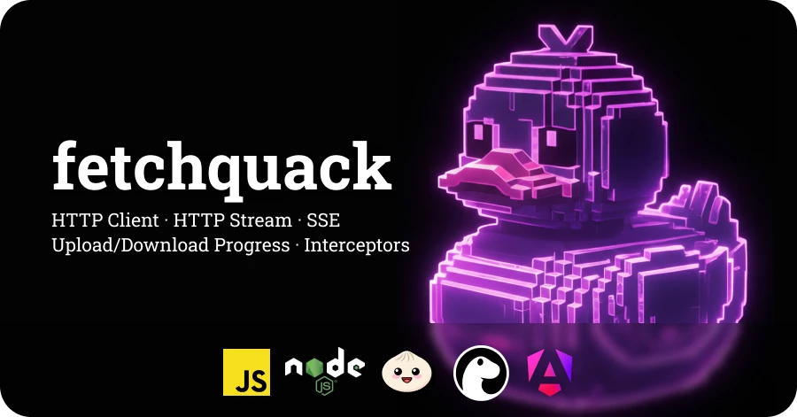

# fetchquack

[](https://www.npmjs.com/package/fetchquack)
[](https://opensource.org/licenses/MIT)

A lightweight, universal HTTP client built on the standard Fetch API. First-class support for **streaming**, **Server-Sent Events (SSE)**, and **progress tracking**.

Works on **Browser**, **Node.js 18+**, **Bun**, **Deno**, and **Angular 17+**.

## Features

- **Streaming** — Text and binary streaming with chunk-by-chunk processing
- **Server-Sent Events** — Full SSE spec with auto-reconnect and Last-Event-ID
- **Progress Tracking** — Upload and download progress on all platforms
- **Interceptors** — Middleware system with built-in auth, logging, CSRF, and header interceptors
- **Angular Integration** — RxJS Observable wrapper with dependency injection support
- **TypeScript** — Complete type definitions with generics
- **Zero Dependencies** — ~4KB minified + gzipped

## Installation

```bash
npm install fetchquack
```

## Quick Start

```typescript
import { HttpClient } from 'fetchquack';

const client = new HttpClient();

// JSON request
const user = await client.fetch<User>({
  method: 'GET',
  url: '/api/users/1'
});

// Streaming
const controller = new AbortController();

client.fetchStream({
  method: 'POST',
  url: '/api/ai/chat',
  body: { prompt: 'Hello!' },
  signal: controller.signal,
  decodeToString: true,
  onData: (chunk) => console.log(chunk),
  onComplete: () => console.log('Done')
});

// Server-Sent Events
client.sse({
  method: 'GET',
  url: '/api/events',
  signal: controller.signal,
  autoReconnect: true,
  onEvent: (event) => console.log(event.data)
});
```

## Documentation

**[Read the full documentation](https://adrian-bueno.github.io/fetchquack/)**

- [Getting Started](https://adrian-bueno.github.io/fetchquack/getting-started/introduction)
- [HTTP Client](https://adrian-bueno.github.io/fetchquack/core/http-client)
- [Requests & Responses](https://adrian-bueno.github.io/fetchquack/core/requests-responses)
- [Interceptors](https://adrian-bueno.github.io/fetchquack/core/interceptors)
- [Streaming](https://adrian-bueno.github.io/fetchquack/features/streaming)
- [Server-Sent Events](https://adrian-bueno.github.io/fetchquack/features/sse)
- [Progress Tracking](https://adrian-bueno.github.io/fetchquack/features/progress)
- [Retry Policies](https://adrian-bueno.github.io/fetchquack/features/retry)
- [Angular Integration](https://adrian-bueno.github.io/fetchquack/integrations/angular)
- [API Reference](https://adrian-bueno.github.io/fetchquack/api)

## Runtime Compatibility

| Runtime | Version |
|---------|---------|
| Browser | Modern browsers |
| Node.js | 18.0+ |
| Bun | 1.0+ |
| Deno | 1.11+ |

## Testing

See [README-tests.md](./README-tests.md) for testing documentation.

## Contributing

Contributions are welcome! Please fork the repository, create a feature branch, and open a pull request.

## License

MIT © [Adrián Bueno Jiménez](https://devadri.com)
